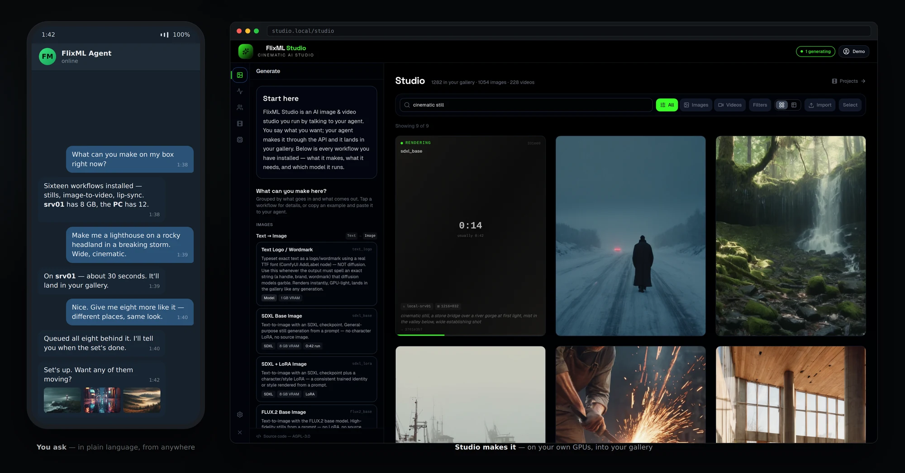

# FlixML Studio



FlixML Studio is a media generation workbench. It runs image and video generation through ComfyUI workflows, trains LoRAs, and exposes everything through a clean REST API with a React UI for browsing, organizing, and queuing work. Jobs are tracked from queue to completion, routed across GPU providers, and organized into projects, scenes, and shots with persistent characters.

It ships with built-in workflows and lets you add your own.

Two ways to use it:

- **API-first** — generate images and video, manage projects, and train LoRAs through a clean REST API. AI agents call the same endpoints humans do.
- **Studio UI** — browse generations, organize projects into scenes and shots, manage characters, and watch what your GPUs are rendering, without touching code. The **Jobs** page times each run in flight against how long that workflow usually takes on that node.

Full documentation: [flixml.com/docs](https://flixml.com/docs).

## Core Concepts

### Image and Video Generation

The main job of the Studio is running image and video generation. You pick a workflow by ID, send a prompt and a few parameters, and the Studio queues the job on the right GPU.

### Projects, Scenes, and Shots

Organize work like a film:

- **Project** — a film, campaign, or collection
- **Scene** — a sequence within the project
- **Shot** — a single image or video clip with version history

Generate inside the structure, or generate standalone.

### Workflows

FlixML Studio is built on [ComfyUI](https://github.com/comfyanonymous/ComfyUI) workflows. Add a workflow JSON file, reference it by ID when generating, and the Studio fills in variables at request time. Built-ins are listed in [docs/WORKFLOWS.md](./docs/WORKFLOWS.md). The template variables are documented in `app/flixml/workflows/registry.py`.

### Providers

Any GPU that runs ComfyUI. Local nodes, remote servers, or RunPod serverless. The API stays the same — the GPU location is just configuration.

```json
// config.json
{
  "gpu_nodes": [
    { "id": "gpu-1", "roles": ["image"], "comfyui": { "url": "http://<your-comfyui-host>:<port>" } },
    { "id": "gpu-2", "roles": ["video"], "comfyui": { "url": "http://<your-comfyui-host>:<port>" } }
  ]
}
```

Each node becomes a provider named `local-<id>`, here `local-gpu-1` and `local-gpu-2`. Studio rejects a video job sent to a node without the `video` role.

### Characters

Register persistent characters with LoRA associations, trigger words, and reference images. Reference them by name in any generation — the Studio resolves the right LoRA and injects the trigger words automatically.

### Agent Identity & API Keys

Give each caller — AI agent, script, person — its own key, sent as `Authorization: Bearer <key>`. An **admin** key sees everything. Any other key sees only what it created: its jobs, its generated and uploaded media, and its projects (and the shots and renders inside them). It sees and generates with only the characters on its allowlist, or every character if the list is empty, and can also be limited to certain workflows or capped on concurrent jobs. A job can't take another caller's file as its input image, video or audio.

Manage keys in Studio under **Settings → API keys**, also reachable from the account menu in the top-right corner: create a key (shown once, with a copy button), change its scope, replace it, revoke it, or delete it. Only admin keys can open that page or its API (`/api/agents`). Studio stores SHA-256 hashes, never the keys, so a lost key can't be shown again; replace it instead. **Settings → Account** shows which key the browser is signed in with and signs it out. The command line does the same with `scripts/manage_agent_keys.py` (`create`, `update`, `list`, `rotate`, `revoke`, `enable`).

`config.json` `security.require_api_key` (default `false`) decides what happens to a request with no key: served unrestricted while it's `false`, rejected with 401 once it's `true`. A key that is sent but unknown or revoked is always rejected. [Secure your install](#secure-your-install) walks through turning it on.

## Getting Started

### Prerequisites

- Python 3.10+
- Node.js 18+
- PostgreSQL
- A running ComfyUI instance (local, remote, or serverless like RunPod)

Add the ComfyUI URL to `config.json` so the Studio can route jobs to it as a provider. See Providers above for an example.

### Installation

```bash
git clone https://github.com/ortegarod/flixml.git
cd flixml

# Config: environment variables and your ComfyUI nodes
cp .env.example .env
cp config.example.json config.json
# Edit .env and config.json for your machine

# API (from the repo root). Migrations run automatically.
pip install -r requirements.txt
createdb flixml_studio
set -a; . ./.env; set +a
PYTHONPATH=app python -m flixml

# Studio UI, in a second terminal from the repo root
set -a; . ./.env; set +a
cd studio && npm install && npm run dev
```

See `.env.example` for all available variables.

### Secure your install

A fresh install requires no key, so anyone who can reach the API or the UI has full access. Before you expose it beyond your own machine, create an admin key and turn keys on.

1. Create your admin key. In the Studio UI, open **Settings → API keys**, click **New key**, tick **Admin**, and copy the key it shows you. On a machine without a browser, run this from the repo root with `.env` loaded instead:

   ```bash
   python scripts/manage_agent_keys.py create me "Me" --admin --key-file ~/.config/flixml/me.key
   ```

   `--key-file` writes the key to a file only you can read. Leave it off to print the key once.
2. Set `"security": { "require_api_key": true }` in `config.json`. The API reads it on every request, so no restart is needed.
3. Reload Studio and paste your key into the sign-in prompt. The browser keeps it in an HttpOnly cookie.
4. Create a key for each agent or script under **Settings → API keys**. They send it as `Authorization: Bearer <key>`.

| Variable | Description |
|---|---|
| `FLIXML_API_URL` | URL the Studio UI uses to reach the backend |
| `DATABASE_URL` | PostgreSQL connection string |
| `FLIXML_OUTPUT_DIR` | Directory where generated media is stored |
| `FLIXML_TRAINING_DIR` | Required. Local folder for LoRA training datasets and configs |
| `FLIXML_LORA_OUTPUT_DIR` | Required. Local folder where trained LoRAs are saved |
| `FLIXML_COMFY_LORA_DIR` | Required. ComfyUI `models/loras` folder trained LoRAs are copied to |
| `ELEVENLABS_API_KEY` | Optional. Lists ElevenLabs voices at `/api/tts/voices`. |

## Quick API Example

Generate an image:

```bash
curl -X POST <your-api-url>/api/image/generate \
  -H "Authorization: Bearer <your-key>" \
  -H "Content-Type: application/json" \
  -d '{
    "workflow": "<workflow-id>",
    "prompt": "portrait of a woman in a red dress, soft studio lighting",
    "provider": "<provider-id>",
    "width": 1024,
    "height": 1024
  }'
```

Leave out the `Authorization` header if your install doesn't require keys. For agents: [SKILL.md](./SKILL.md) covers images, video, lip-sync, and multi-shot projects. The field reference is `GET /openapi.json`.

## MCP Server

`scripts/mcp_server.py` exposes a running Studio over the [Model Context
Protocol](https://modelcontextprotocol.io), so an MCP host — Claude Desktop, Claude
Code, Cursor — can drive it without being taught the HTTP API first. It covers the
whole pipeline: workflows and nodes, image and video generation, job lookup, media
search and upload, characters, and projects through to a rendered movie. It also
serves `SKILL.md` and the OpenAPI schema as MCP resources, read live from your
install, so the host learns your workflows rather than a hardcoded list.

Python standard library only — no install step, nothing to add to your environment.

```json
{
  "mcpServers": {
    "flixml": {
      "command": "python",
      "args": ["/path/to/flixml/scripts/mcp_server.py"],
      "env": {
        "FLIXML_API_URL": "http://localhost:8191",
        "FLIXML_API_KEY_FILE": "~/.config/flixml/key"
      }
    }
  }
}
```

`FLIXML_API_KEY_FILE` points at a file holding the key, so it stays out of the host's
config. `FLIXML_API_KEY` works too if you'd rather set it inline. Omit both if your
install doesn't require keys.

## LoRA Training

Register a dataset, start training, monitor checkpoints — all through the API. The examples below use `<your-api-url>` as a placeholder for your Studio API base URL.

### Configuration

LoRA training is designed around disposable DigitalOcean GPU droplets. Set these variables so the Studio can provision an AMD ROCm droplet, install AI Toolkit, and run training in one step:

| Variable | Description |
|---|---|
| `DIGITALOCEAN_TOKEN` | DigitalOcean API token |
| `TRAINING_CLOUD_SIZE` | Droplet size slug |
| `TRAINING_CLOUD_IMAGE` | Droplet image slug |
| `TRAINING_CLOUD_TTL_HOURS` | Droplet lifetime in hours |
| `TRAINING_CLOUD_REPO_URL` | Repository cloned onto the droplet |
| `TRAINING_CLOUD_SSH_KEYS` | Comma-separated SSH key IDs or fingerprints |

If you already run your own AI Toolkit server, point the Studio at it instead:

| Variable | Description |
|---|---|
| `AITK_API_URL` | AI Toolkit API URL |
| `AITK_API_TOKEN` | AI Toolkit API token — optional |
| `AITK_GPU_IDS` | GPU IDs to use for training — optional |

### Usage

```bash
# Register dataset
curl -X POST <your-api-url>/api/lora-training/datasets \
  -d '{"id": "my-character", "name": "My Character"}'

# Start training
curl -X POST <your-api-url>/api/lora-training/start \
  -d '{
    "job_name": "my-character-v1",
    "trigger_word": "mycharacter",
    "dataset": "my-character",
    "base_config": "flux2_identity"
  }'

# Check status
curl <your-api-url>/api/lora-training/status?job_name=my-character-v1

# List checkpoints
curl <your-api-url>/api/lora-training/checkpoints
```

Training runs on AMD ROCm via the Ostris AI Toolkit.

## Repository Layout

| Path | Purpose |
|---|---|
| `app/` | FastAPI backend and workflow engine |
| `studio/` | React + Vite frontend |
| `migrations/` | Database migrations |
| `docker/` | Container setup |
| `scripts/` | MCP server, key management, install helpers |
| `SKILL.md` | Agent guide (also served raw at `/api/guide`) |

## License

GNU AGPL-3.0 — see [LICENSE](LICENSE). Copyright © 2026 Rodrigo Ortega.

Run it, fork it, modify it, use it commercially. The one condition: if you run a
modified version as a network service, you have to publish your modifications
under the same license. Self-hosting FlixML as-is for yourself, your team, or your
clients requires nothing of you.

If you want to build on FlixML without publishing your changes, a commercial
license is available — open an issue.

---

*Built for creators who want to work with ideas, not node graphs.*
